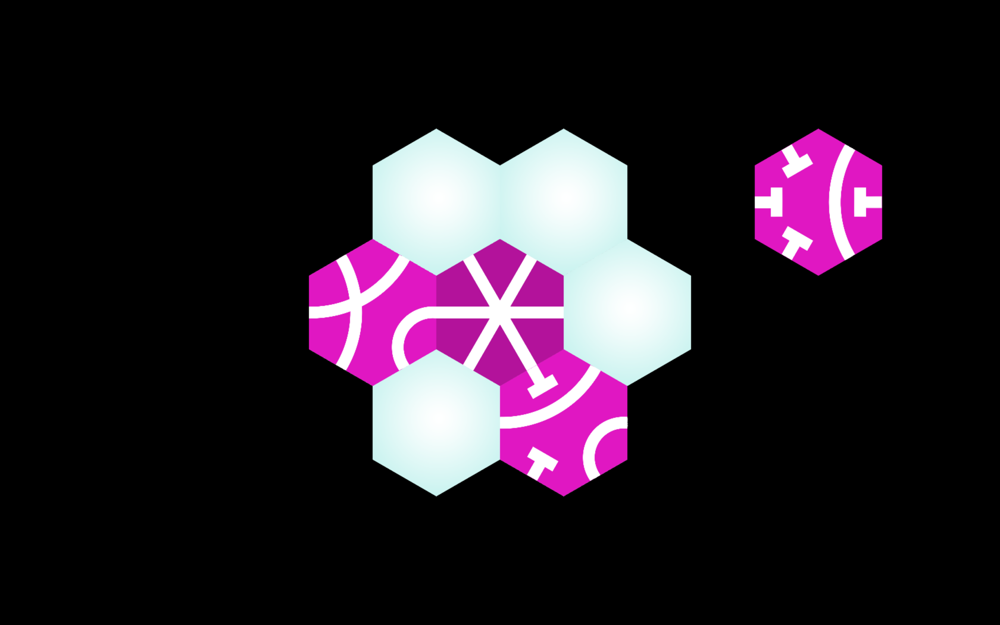

# Circuitous Circuits

A [Train Jam 2019](https://itch.io/jam/train-jam-2019) game by Mikayla Hutchinson([@mjhutchinson](https://twitter.com/mjhutchinson))
and Candy Emberley ([@CandyComposer](https://twitter.com/CandyComposer)).

Make the longest circuit that meets up with itself - a circuitous circuit!

Binaries are available [on itch.io](https://mhutch.itch.io/circuitous-circuits).

NOTE: we didn't figure out how to measure or incentivize the *longest* circuit
so currently *any* circuit is enough to advance to the next level.

This game was made with [the Godot engine](https://godotengine.org/).

## License

* Code by Mikayla Hutchinson, licensed under [the MIT license](https://opensource.org/licenses/MIT)
* Music and sound by Candy Emberley, licensed under [the CC-BY-4.0 license](https://creativecommons.org/licenses/by/4.0/)
* Art by Candy Emberley and Mikayla Hutchinson, licensed under [the CC-0 license](https://creativecommons.org/share-your-work/public-domain/cc0/)